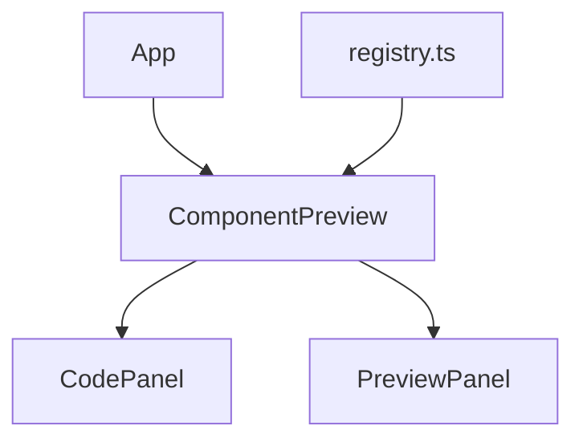

# Documento de Diseño

## Resumen

Previsualizador de componentes para la librería interna de Fonasa. Aplicación React que muestra el código fuente de componentes junto a su vista previa en vivo. Enfoque copy-paste — sin publicación npm. El primer componente es un Input con variantes (normal, error, deshabilitado).

Stack: React 19, TypeScript, Vite 8, Tailwind CSS 4.

## Arquitectura

Arquitectura simple de componentes React sin routing ni estado global. La app renderiza una lista de componentes registrados, cada uno con su panel de código y panel de preview.



- **App**: Layout principal, renderiza los componentes registrados.
- **ComponentPreview**: Contenedor que muestra un componente con su nombre, código y preview lado a lado.
- **CodePanel**: Muestra el código fuente con resaltado básico y botón de copiar.
- **PreviewPanel**: Renderiza el componente en vivo con sus variantes.
- **registry.ts**: Archivo de registro donde se definen los componentes disponibles con su código fuente y configuración de preview.

## Componentes e Interfaces

### ComponentPreview

Componente contenedor que recibe un `ComponentEntry` del registro y renderiza el CodePanel y PreviewPanel.

```typescript
interface ComponentPreviewProps {
  entry: ComponentEntry;
}
```

### CodePanel

Muestra código fuente con resaltado básico (usando `<pre><code>` con clases de Tailwind para colores) y un botón para copiar al portapapeles.

```typescript
interface CodePanelProps {
  code: string;
  language?: string;
}
```

Usa `navigator.clipboard.writeText()` para copiar. Muestra feedback visual (ícono check o mensaje de error) tras el intento de copia.

### PreviewPanel

Renderiza las variantes del componente en vivo.

```typescript
interface PreviewPanelProps {
  variants: ComponentVariant[];
}
```

### Input (componente de librería)

Componente reutilizable con soporte para estados.

```typescript
interface InputProps {
  label?: string;
  placeholder?: string;
  error?: string;
  disabled?: boolean;
  value?: string;
  onChange?: (e: React.ChangeEvent<HTMLInputElement>) => void;
}
```

## Modelos de Datos

### ComponentEntry

Estructura central del registro de componentes.

```typescript
interface ComponentEntry {
  name: string;
  code: string;
  variants: ComponentVariant[];
}

interface ComponentVariant {
  label: string;
  props: Record<string, unknown>;
  render: () => React.ReactNode;
}
```

### Registry

```typescript
// src/registry.ts
const registry: ComponentEntry[] = [
  {
    name: "Input",
    code: `// código fuente del componente Input...`,
    variants: [
      { label: "Normal", props: {}, render: () => <Input placeholder="Ingrese texto" /> },
      { label: "Error", props: {}, render: () => <Input placeholder="Ingrese texto" error="Campo requerido" /> },
      { label: "Deshabilitado", props: {}, render: () => <Input placeholder="No disponible" disabled /> },
    ],
  },
];
```


## Correctness Properties

*A property is a characteristic or behavior that should hold true across all valid executions of a system — essentially, a formal statement about what the system should do. Properties serve as the bridge between human-readable specifications and machine-verifiable correctness guarantees.*

### Property 1: Code fidelity — display and copy preserve source exactly

*For any* ComponentEntry with a non-empty code string, both the CodePanel rendered output and the value passed to clipboard on copy should be exactly equal to the original code string (preserving whitespace and indentation).

**Validates: Requirements 1.1, 1.3**

### Property 2: All variants are rendered

*For any* ComponentEntry with N variants (N ≥ 1), the PreviewPanel should render exactly N variant sections, each identified by its label.

**Validates: Requirements 2.3**

### Property 3: Component name displayed as heading

*For any* ComponentEntry, the rendered ComponentPreview should contain the entry's name as a visible heading element.

**Validates: Requirements 4.2**

## Manejo de Errores

| Escenario | Comportamiento |
|---|---|
| Fallo en clipboard (`navigator.clipboard.writeText` rechazado) | Mostrar mensaje de error temporal ("No se pudo copiar") junto al botón de copiar. Usar `try/catch` alrededor de la llamada async. |
| Componente de preview lanza error en render | Envolver PreviewPanel en un Error Boundary que muestre un mensaje fallback en lugar de crashear toda la app. |
| Registry vacío | Mostrar mensaje indicando que no hay componentes disponibles. |

## Estrategia de Testing

### Unit Tests (example-based)

- CodePanel renderiza código dentro de `<pre><code>` con clases apropiadas (1.2)
- Botón copiar muestra error cuando clipboard falla (1.4)
- PreviewPanel renderiza componente interactivo — simular typing en Input (2.1, 2.2)
- Input registry entry tiene 3 variantes: normal, error, deshabilitado (3.2)
- Cada variante del Input muestra placeholder (3.3)
- Layout muestra ambos paneles simultáneamente (4.1)
- Clases responsive aplicadas correctamente (4.3)

### Property Tests

- **Librería PBT**: Vitest con `fast-check`
- **Mínimo 100 iteraciones** por property test
- **Tag format**: `Feature: component-library-preview, Property {N}: {texto}`

Property tests a implementar:
1. Fidelidad del código (display + copy) — genera strings arbitrarios con whitespace variado
2. Todas las variantes se renderizan — genera arrays de variants con largo aleatorio
3. Nombre del componente visible como heading — genera nombres aleatorios

### Smoke Tests

- Registry contiene el componente "Input" con código no vacío (3.1)
